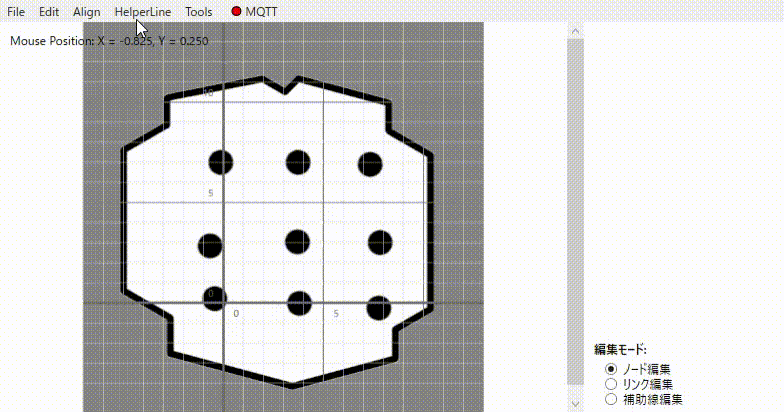

# node/link editor

地図座標系においてでnode(経路点)とlink(経路接続)を視覚的に編集・管理するWPF製のデスクトップアプリケーション。主にAMR向けの経路設計に使用することを想定。

## デモ

1. 補助線を引き、交差点にnodeを作成
2. 選択したnode間に等間隔でnodeを作成
3. 最初と最後のnodeを基準に整列
4. node間にlinkを設定

## 機能

- 地図読み込み  
  rosで使用する2次元マップ(.yamlと.pgm)を想定。
- node作成・編集  
  クリックした場所にnodeを作成。属性や位置を編集。
- link作成・編集  
  クリックしたnodeに対してlinkを作成。属性を編集。
- 補助線作成・編集  
  補助線の交差点にnodeを作成、補助線上にnodeを移動、など。
- ファイル保存・読み込み  
  作成したnode,link,補助線を使用した地図と紐づけての保存・読み込み。

## 使用技術・ライブラリ

- MQTTnet(5.0.1.1416)
- Newtonsoft.Json(13.0.3)
- YamlDotNet(16.3.0)

## 開発環境

- OS: Windows 10
- 開発環境: Visual Studio 2022
- .NET バージョン: .NET 9
